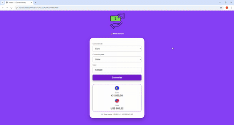

# 💱 Conversor de Moedas

Aplicação web para conversão de moedas em tempo real, desenvolvida com foco em boas práticas de HTML, CSS e JavaScript.

---

## 🚀 Funcionalidades
- Conversão entre Real, Dólar, Euro, Libra e Bitcoin
- Atualização automática das taxas de câmbio
- Interface responsiva (mobile, tablet e desktop)
- Modo claro e modo escuro
- Exibição apenas das moedas selecionadas

---

## 🛠️ Tecnologias utilizadas
- HTML5
- CSS3 (Flexbox, Media Queries)
- JavaScript (ES6+)
- API de câmbio (ExchangeRate API)

---

## 🌐 Acesse o projeto
🔗 **GitHub Pages:**  
https://helena-barbosa.github.io/conversor-de-moedas/

🔗 **Repositório:**  
https://github.com/Helena-Barbosa/conversor-de-moedas

---

## 👩‍💻 Autora
Helena Barbosa🐬